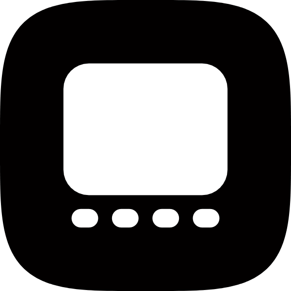
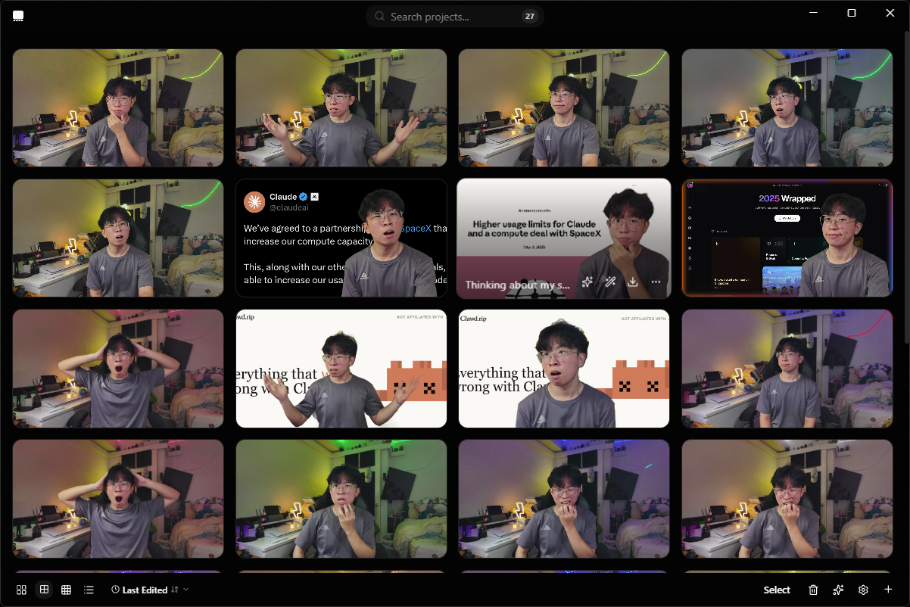
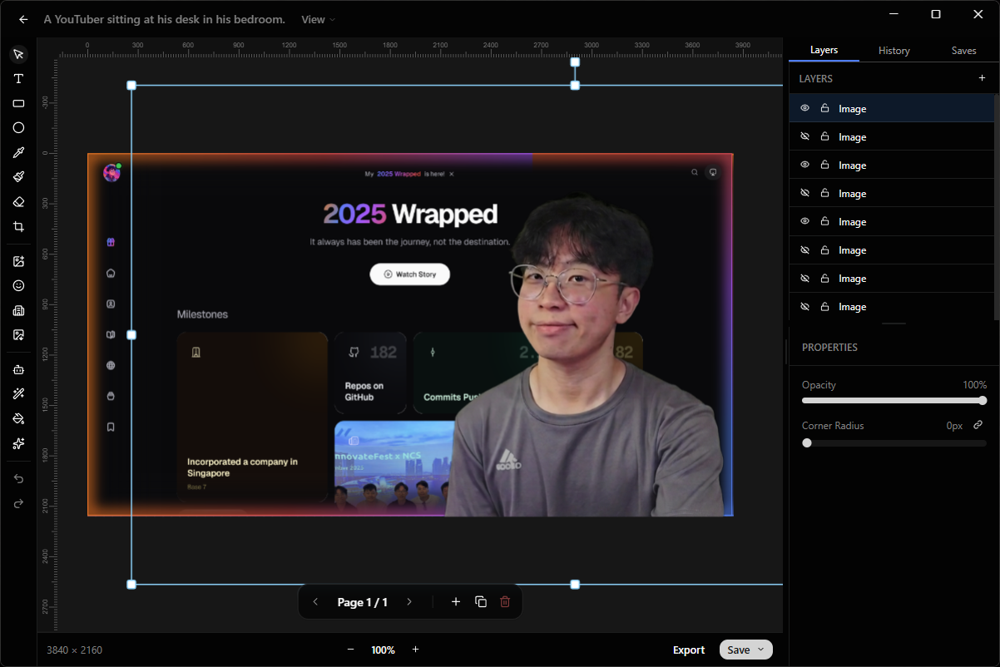

<table width="100%">
  <tr>
    <td align="center" width="120">
      
    </td>
    <td align="right">
      <h1>🎭 Outpost</h1>
      <h3 style="margin-top: -10px;">The open-source YouTube thumbnail studio</h3>
    </td>
  </tr>
</table>

**Outpost** is a free, open-source desktop app for making YouTube thumbnails that actually get clicks. Everything runs on your machine.

[](https://github.com/amajorai/outpost)
[](https://github.com/amajorai/outpost)
[](https://github.com/amajorai/outpost)
[](https://github.com/amajorai/outpost/issues)
[](https://github.com/amajorai/outpost/releases)

[](https://github.com/amajorai/outpost/actions)
[](https://github.com/amajorai/outpost/releases/latest)
[](https://github.com/amajorai/outpost/releases/latest)
[](https://github.com/amajorai/outpost/releases/latest)





## Features

- **Layer-based editor** with drag, resize, rotate, undo/redo, and auto-save
- **Video frame extraction** - scrub any video and pull a frame as a full-res image
- **Background removal** via WebAssembly (all builds) or BRIA RMBG-1.4 (open-source build)
- **AI image generation** with Gemini (bring your own API key)
- **Carousel generator** for multi-page thumbnail layouts
- **Gallery** with search, sort, bulk operations, and 30-day trash
- Export to PNG, JPEG, WebP, APNG, and GIF

## Getting Started

### Prerequisites

- [Bun](https://bun.sh/)
- [Rust](https://rustup.rs/)

### Run

```bash
bun install
bun run desktop:dev
```

### Build

```bash
bun run desktop:build
```

The open-source build includes BRIA RMBG-1.4 (non-commercial license). See the [model page](https://huggingface.co/briaai/RMBG-1.4) for details.

```bash
cd apps/desktop
bunx tauri build -- --features bria
```

## License

Source code is open source. The BRIA model is restricted to non-commercial use.

## Star History

<a href="https://www.star-history.com/#amajorai/outpost&Date">
 <picture>
   <source media="(prefers-color-scheme: dark)" srcset="https://api.star-history.com/svg?repos=amajorai/outpost&type=Date&theme=dark" />
   <source media="(prefers-color-scheme: light)" srcset="https://api.star-history.com/svg?repos=amajorai/outpost&type=Date" />
   
 </picture>
</a>
